# 📈 Stock Market Analyzer

A comprehensive Jupyter Notebook project for **downloading, exploring, analyzing, and visualizing** stock-market data using **yfinance**, **Pandas**, **NumPy**, **Matplotlib**, and **Seaborn**.

The analysis is divided into two clear parts:

1. **Part 1 — Single Company Analysis** — deep dive into one selected ticker  
2. **Part 2 — Multiple Company Analysis** — side-by-side comparison of several companies on price performance, returns, volatility, volume, and risk

> **Note:** An internet connection is required when the data-download cells are executed.  
> All charts are displayed in the notebook **and** saved as high-quality PNG files in the `charts/` folder.

---

## ✨ Features

### Part 1 — Single Company Analysis
- Select any ticker from a curated company list (AAPL, NVDA, MSFT, TSLA, AMZN, GOOGL)
- Download historical OHLCV data for a custom date range
- Explore dataset shape, head, dtypes, missing values, and descriptive statistics
- Engineer useful columns (Year, Month, Day, Daily Return, Price Change)
- Compute key metrics (average open/close, max/min prices, volume, daily return & volatility)
- Year-wise performance summary (start/end close, average volume, yearly return %)
- Visualizations:
  - Closing price over time
  - Trading volume over time
  - Daily return distribution (with KDE)
  - Closing price with 20-day & 50-day moving averages
  - Yearly returns bar chart

### Part 2 — Multiple Company Analysis
- Select multiple tickers for comparison
- Download aligned Close prices for all selected companies
- Normalized price performance (start = 100)
- Total return, average daily return, volatility, and average volume comparison
- Correlation heatmap of daily returns
- Risk–return scatter plot

---

## 🛠️ Tech Stack

- **Python 3**
- **yfinance** — live market data download
- **Pandas** — data manipulation, cleaning, and aggregation
- **NumPy** — numerical calculations
- **Matplotlib** + **Seaborn** — professional charts
- **Jupyter Notebook** — interactive analysis environment

---

## 🧠 Skills Demonstrated

| Concept                        | Implementation                                      |
|--------------------------------|-----------------------------------------------------|
| **API Data Fetching**          | `yfinance` for historical OHLCV data                |
| **Data Cleaning & Preparation**| MultiIndex flattening, datetime handling, feature engineering |
| **Exploratory Data Analysis**  | Shape, head, dtypes, missing values, describe       |
| **Financial Metrics**          | Daily returns, volatility, total return, yearly returns |
| **Time-Series Visualization**  | Price trends, volume, moving averages               |
| **Comparative Analysis**       | Normalized performance, correlation, risk-return    |
| **Reproducible Workflow**      | Hard-coded defaults, clear sectioning, saved charts |

---

## 📊 Workflow

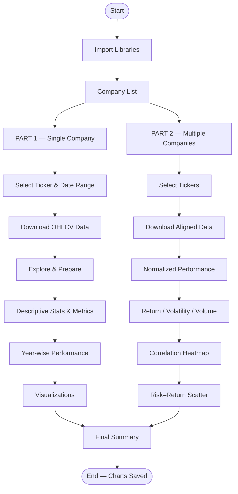

---

## 📸 Screenshots

### 1️⃣ Libraries & Setup

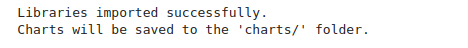

### 2️⃣ Company Reference Table

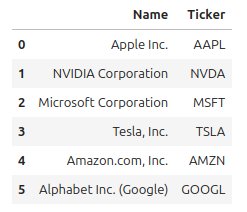

### 3️⃣ Selected Company & Date Range

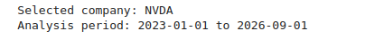

### 4️⃣ Downloaded Single-Company Data

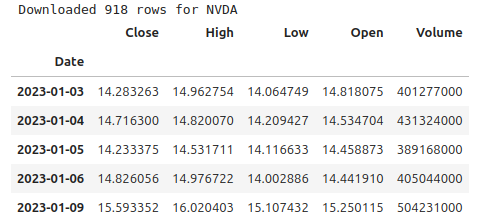

### 5️⃣ Dataset Exploration

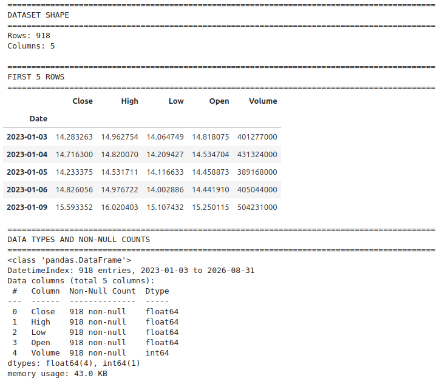

### 6️⃣ Missing Values & Descriptive Statistics

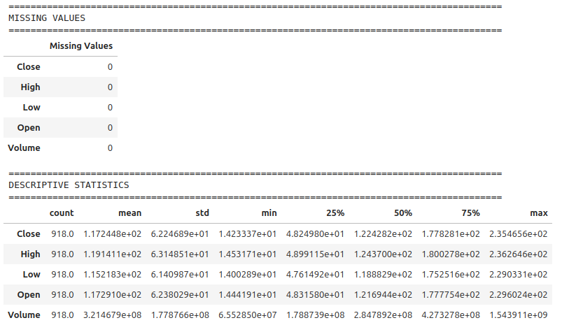

### 7️⃣ Prepared Data with New Columns

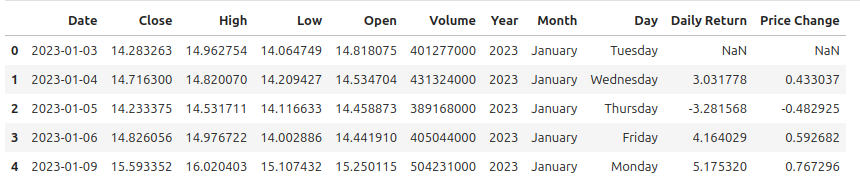

### 8️⃣ Key Numerical Metrics

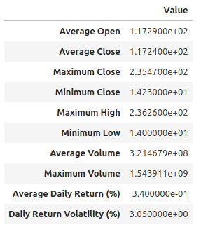

### 9️⃣ Year-wise Performance Summary

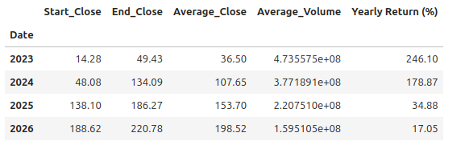

### 🔟 Highlights Summary

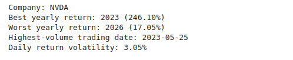

### 1️⃣1️⃣ Multi-Company Selection

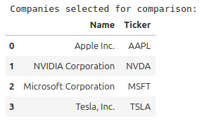

### 1️⃣2️⃣ Multi-Company Close Prices

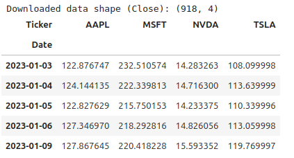

### 1️⃣3️⃣ Comparison Summary Table

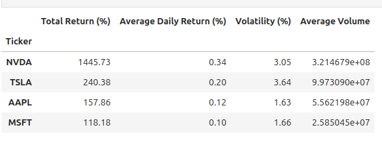

---

## 📈 Generated Charts

### Single Company (NVDA example)

| Chart | Description |
|-------|-------------|
| **Closing Price** | Price trend over the selected period |
| **Trading Volume** | Daily volume time series |
| **Daily Return Distribution** | Histogram + KDE of daily returns |
| **Moving Averages** | Close price with 20-day & 50-day MAs |
| **Yearly Returns** | Bar chart of annual performance |

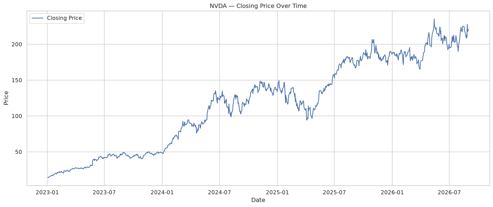
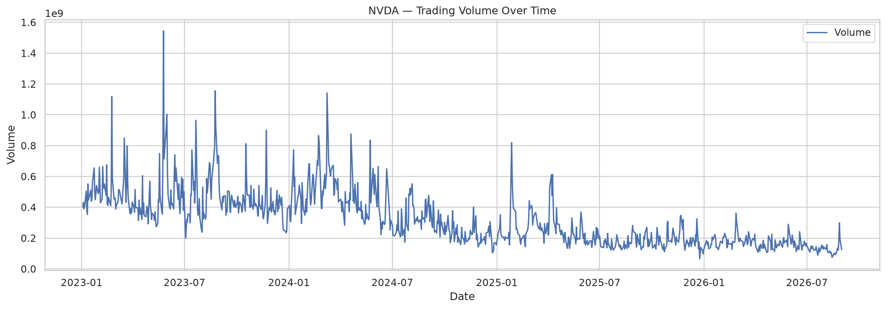
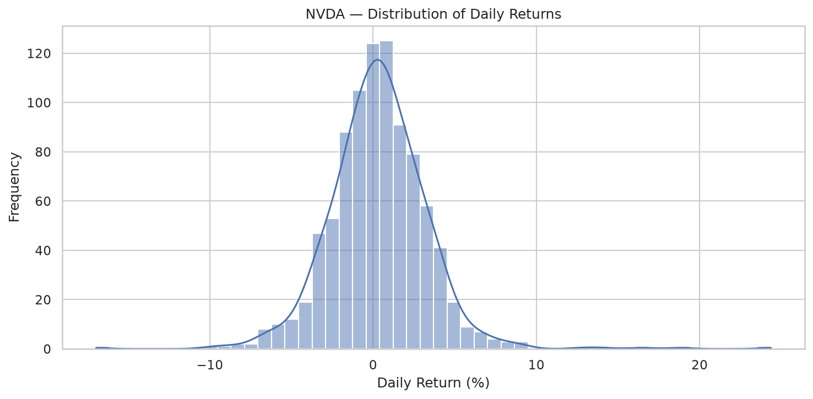
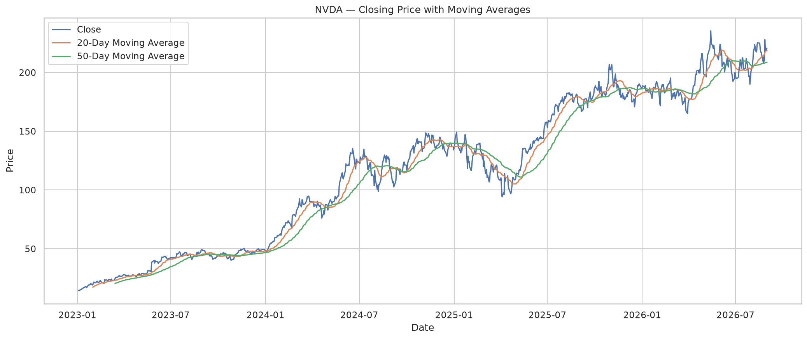
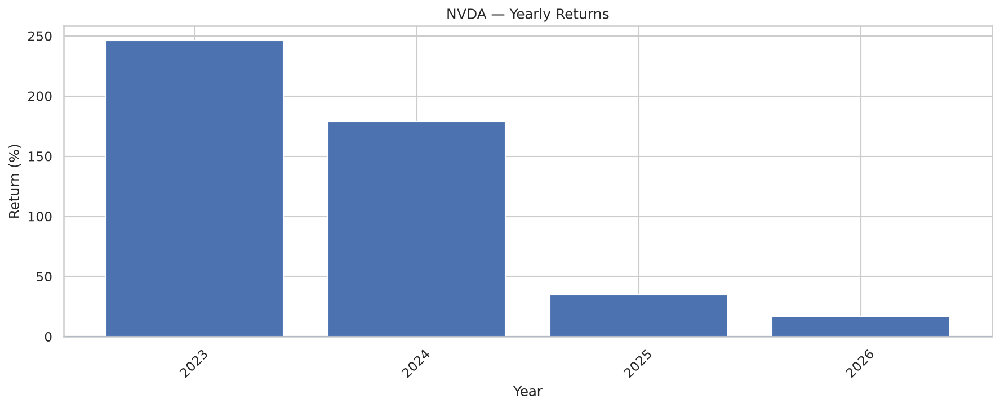

### Multiple Companies

| Chart | Description |
|-------|-------------|
| **Normalized Performance** | All tickers rebased to 100 |
| **Total Return Comparison** | Bar chart of cumulative returns |
| **Volatility Comparison** | Daily return volatility by company |
| **Average Volume Comparison** | Trading activity ranking |
| **Correlation Heatmap** | Daily-return correlations |
| **Risk–Return Scatter** | Volatility vs Total Return |

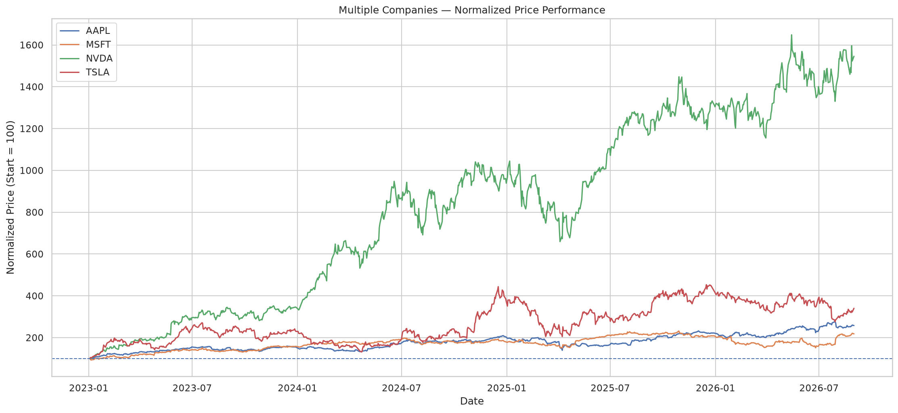
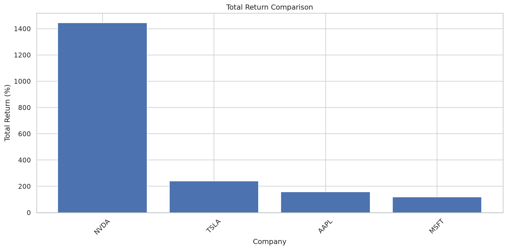
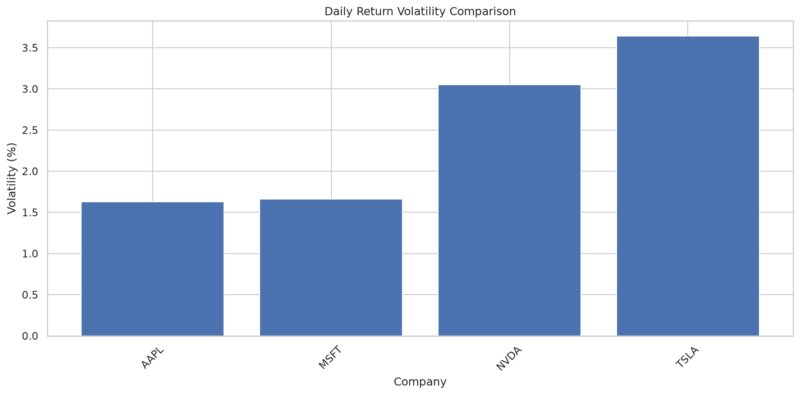
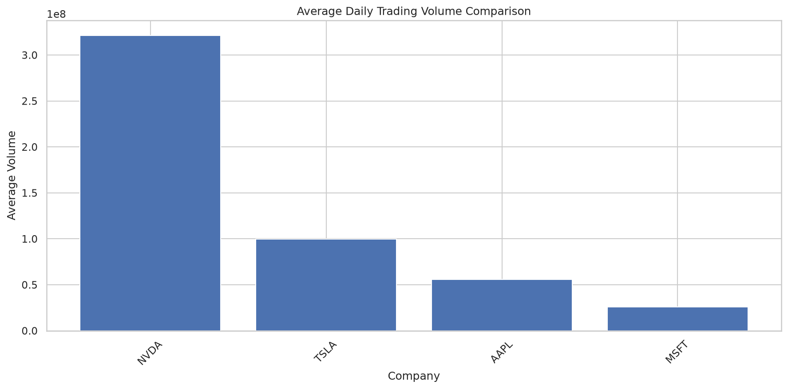
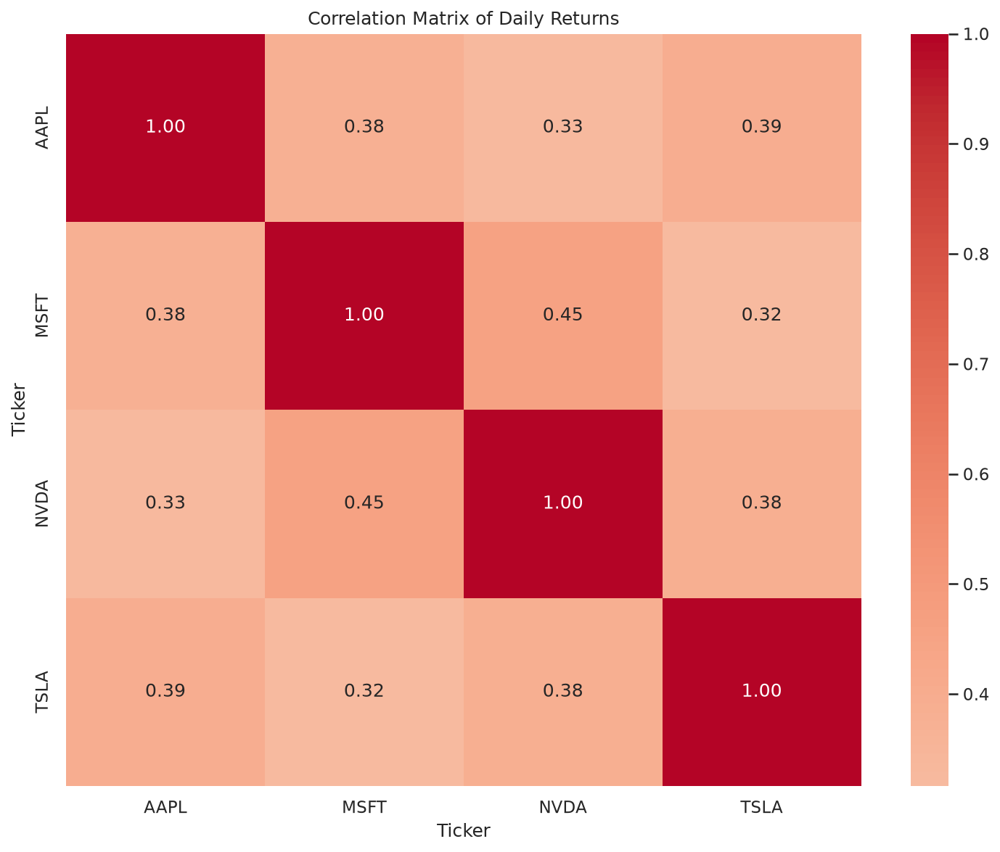
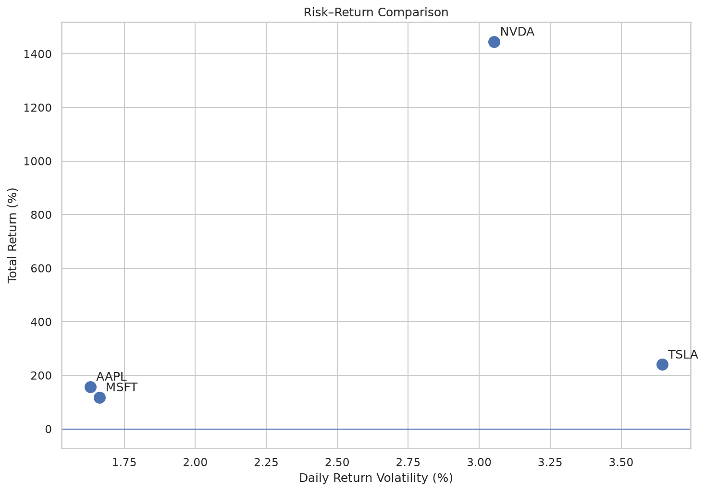

---

## 📁 Project Structure

```text
.
├── Stock_Market_Analyzer_Fixed.ipynb   # Main notebook
├── README.md
├── charts/                             # All generated PNG charts
│   ├── NVDA_closing_price.png
│   ├── NVDA_volume.png
│   ├── NVDA_daily_return_dist.png
│   ├── NVDA_moving_averages.png
│   ├── NVDA_yearly_returns.png
│   ├── multi_normalized_performance.png
│   ├── multi_total_returns.png
│   ├── multi_volatility.png
│   ├── multi_volume.png
│   ├── multi_correlation_heatmap.png
│   └── multi_risk_return.png
└── Screenshots/
    ├── Screenshot-1.png
    ├── Screenshot-2.png
    ├── ...
    └── Screenshot-13.png
```

---

## ▶️ How to Run

1. Open the notebook in Jupyter / VS Code / Google Colab:

```bash
jupyter notebook Stock_Market_Analyzer_Fixed.ipynb
```

2. Install dependencies if needed:

```bash
pip install yfinance pandas numpy matplotlib seaborn
```

3. Run all cells in order.  
   - Edit the `ticker`, `start_date`, and `end_date` cells to analyze different companies or periods.  
   - Charts are automatically saved to the `charts/` folder.

> **Internet required** for the `yfinance` download cells.

---

## 📋 Available Companies

| Name                     | Ticker |
|--------------------------|--------|
| Apple Inc.               | AAPL   |
| NVIDIA Corporation       | NVDA   |
| Microsoft Corporation    | MSFT   |
| Tesla, Inc.              | TSLA   |
| Amazon.com, Inc.         | AMZN   |
| Alphabet Inc. (Google)   | GOOGL  |

You can easily add more tickers to the company list.

---

## 💼 Why Recruiters Should Care

This project demonstrates practical skills that map directly to quantitative analysis and data science roles in finance:

- ✅ End-to-end **financial data pipeline** (download → clean → analyze → visualize)
- ✅ Real-world use of **yfinance** for live market data
- ✅ Calculation of core **risk & return metrics** (volatility, total return, correlation)
- ✅ Clean **time-series visualization** (price, volume, moving averages, distributions)
- ✅ Side-by-side **multi-asset comparison** with normalized performance and risk-return plots
- ✅ Fully reproducible notebook with saved charts and clear documentation

Ideal for showcasing applied data analysis skills in a finance context.

---

⭐ If you found this project useful, consider giving it a star!

## 👨‍💻 Author

**Akshar Tailor**
